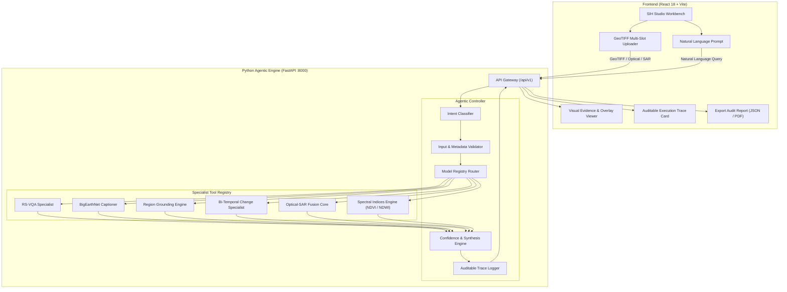

# 🌍 SatQuery AI — Agentic Remote Sensing Vision-Language Platform
> **Smart India Hackathon (SIH) 2026**  
> *See Earth. Understand Tomorrow.*

[](https://sih.gov.in)
[](https://fastapi.tiangolo.com)
[](https://reactjs.org)
[]()

---

## 📌 Problem Statement Overview
Traditional remote-sensing AI tools operate in isolation—requiring GIS domain expertise, manual band selection, and specialized preprocessing. **SatQuery AI** is an interactive, agentic vision-language assistant designed to analyze **single**, **bi-temporal**, and **cross-modal (Optical + SAR)** satellite imagery through natural language queries.

### Mandatory Scope Fulfillment

| # | SIH Mandatory Requirement | SatQuery AI Implementation | Status |
|---|---|---|:---:|
| 1 | **Single-Image VQA** | Natural language QA on satellite scene features, terrain, and land use (RSVQA / VRSBench protocol) | ✅ Integrated |
| 2 | **Captioning & Scene Description** | Hierarchical scene descriptions adapted to BigEarthNet 19-class CORINE taxonomy | ✅ Integrated |
| 3 | **Text-Guided Region Grounding** | Text-directed bounding boxes and pixel segmentation overlays ("Highlight the water body") | ✅ Integrated |
| 4 | **Bi-Temporal Change Analysis** | Differential change detection, change maps, and change VQA ("What changed between these dates?") | ✅ Integrated |
| 5 | **Cross-Modal Optical–SAR Fusion** | Joint feature extraction from co-registered Optical + SAR pairs (Cartosat + RISAT / Sentinel-1 & 2) | ✅ Integrated |
| 6 | **Agentic Orchestration & Trace** | Automatic intent classification, input validation, tool sequencing, confidence score, and auditable execution log | ✅ Integrated |
| 7 | **GeoTIFF / Multi-Modal Support** | Native parsing of multi-band GeoTIFF, SAR intensity, TIFF, PNG, and JPEG with radiometric normalization | ✅ Integrated |

---

## 🏗️ System Architecture



---

## 🚀 Quick Start Guide

### Prerequisites
- **Python 3.10+** (Python 3.12 or 3.13 recommended)
- **Node.js v18+** & npm

### 1. Launch Python AI Backend
```bash
# Navigate to backend directory
cd D:\Satquery-AI\backend

# Activate virtual environment
.\venv\Scripts\Activate.ps1

# Install dependencies (if not already installed)
pip install -r requirements.txt

# Run the FastAPI server
python -m uvicorn main:app --host 127.0.0.1 --port 8000 --reload
```
*Backend API docs available at:* `http://127.0.0.1:8000/docs`

### 2. Launch React Frontend
```bash
# Navigate to client directory
cd D:\Satquery-AI\satquery-ai\client

# Install dependencies
npm install

# Start Vite development server
npm run dev
```
*Frontend opens at:* `http://localhost:5173`

---

## 🧪 Benchmark Scenarios for Evaluators

SatQuery AI includes **pre-packaged benchmark datasets** ready for one-click testing in the SIH Studio:

### Scenario 1: Single Optical Scene (Sentinel-2)
- **Modality**: Optical Multispectral (512x512 GeoTIFF)
- **Representative Queries**:
  - *"Describe the land-cover and major objects visible in this image."*
  - *"Highlight the water body referred to in the query."*
  - *"Is there an urban settlement or building cluster present?"*

### Scenario 2: Bi-Temporal Pair (Flood Inundation & Urban Expansion)
- **Modality**: Multitemporal Optical Pair ($T_1$ Pre-event, $T_2$ Post-event)
- **Representative Queries**:
  - *"What changed between these two dates, and where did the change occur?"*
  - *"Has the built-up area increased, decreased, or remained unchanged?"*
  - *Returns:* Colorized spatial change map (Red = loss, Green = gain, Blue = inundation).

### Scenario 3: Optical + SAR Cross-Modal Pair (Cartosat + RISAT)
- **Modality**: Co-registered Optical RGB + Synthetic Aperture Radar (SAR backscatter)
- **Representative Queries**:
  - *"Use the optical and SAR images together to identify built-up and water-covered regions."*
  - *"How does SAR backscatter confirm structural features under hazy conditions?"*
  - *Returns:* SAR speckle-filtered double-bounce composite and dual-confirmation water/urban masks.

---

## 📋 Auditable Execution Trace Format
Every agentic response outputs an auditable trace meeting the SIH evaluation requirements:

```json
{
  "timestamp": "2026-09-19T18:00:00.000Z",
  "execution_status": "SUCCESS",
  "selected_task": "CROSS_MODAL_OPTICAL_SAR",
  "input_validation": {
    "count": 2,
    "modalities": ["Optical RGB", "SAR"],
    "dimensions": ["512x512 (bands: 3)", "512x512 (bands: 1)"],
    "formats": ["TIFF/GeoTIFF", "TIFF/GeoTIFF"],
    "co_registration": "VALIDATED"
  },
  "models_or_tools_invoked": [
    "RS-CrossModal-Fusion-Core",
    "Optical-SAR-DoubleBounce-Detector"
  ],
  "permitted_parameters": {
    "fusion_mode": "Structural_and_Dielectric_Joint_Inference",
    "sar_filter": "Lee_Sigma_Log_Transform",
    "cloud_delineation": true
  },
  "estimated_confidence": 0.93,
  "latency_ms": 48.2,
  "eval_framework": "SIH-2026-RS-Agentic-Evaluation"
}
```

---

## 🛡️ License
Developed for the Smart India Hackathon 2026. All rights reserved.
